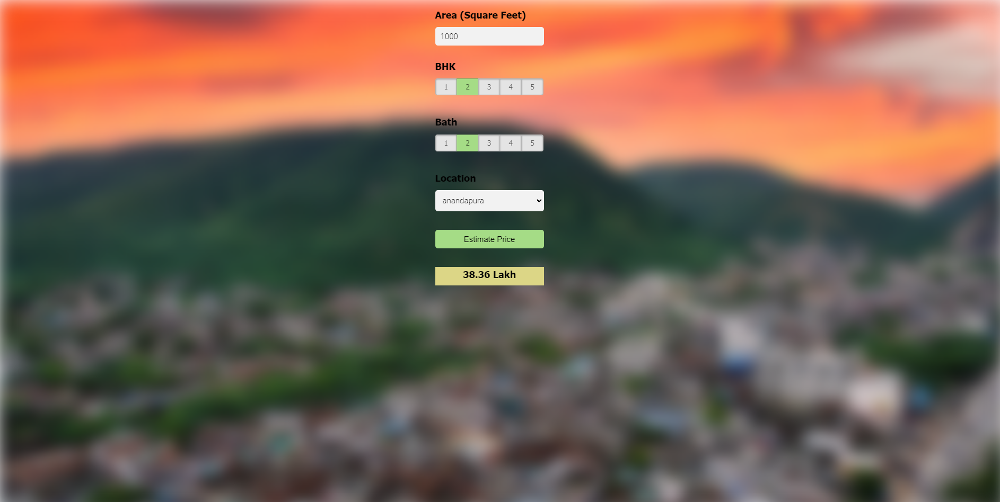

Bangalore House Price Prediction
This is a web application that predicts the price of houses in Bangalore using a linear regression model created using the Scikit-learn library in Python. The application uses Flask to create an HTTP server and HTML/CSS/JavaScript for the user interface.

 # Getting Started
To get started with the project, you need to first clone the repository to your local machine.
```
git clone https://github.com/your_username/bangalore-house-price-prediction.git
cd bangalore-house-price-prediction
```
# Prerequisites
The following are the prerequisites for running the application:

- Python 3.x
- Flask
- Scikit-learn
- NumPy
- Pandas
- Nginx

You can install all these prerequisites using the following command:

```
pip install -r requirements.txt
sudo apt-get install nginx
```
# Running the Application
To run the application, you need to execute the app.py file using Python.


This will start the Flask server on http://localhost:5000.

To run Nginx as a reverse proxy server, you need to first update the Nginx configuration file.

# Usage
Once you access the application, you can enter the following details:

- Total Square Feet: The total square feet of the house.
- Number of Bedrooms: The number of bedrooms in the house.
- Number of Bathrooms: The number of bathrooms in the house.
- Location: The location of the house in Bangalore.

Once you enter these details and click on the "Predict" button, the application will use the linear regression model to predict the price of the house based on the entered details.
